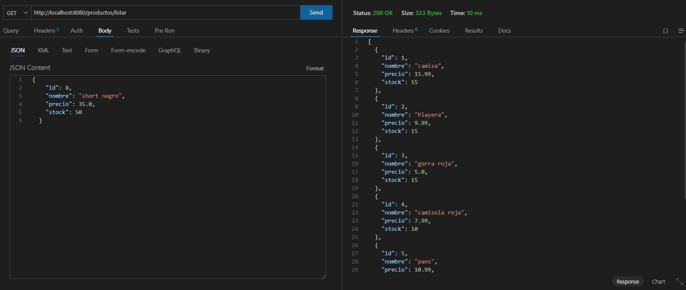
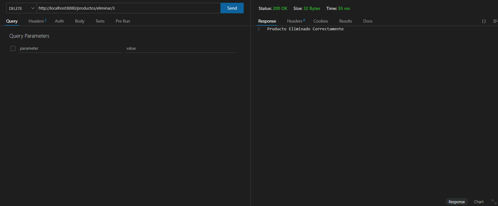
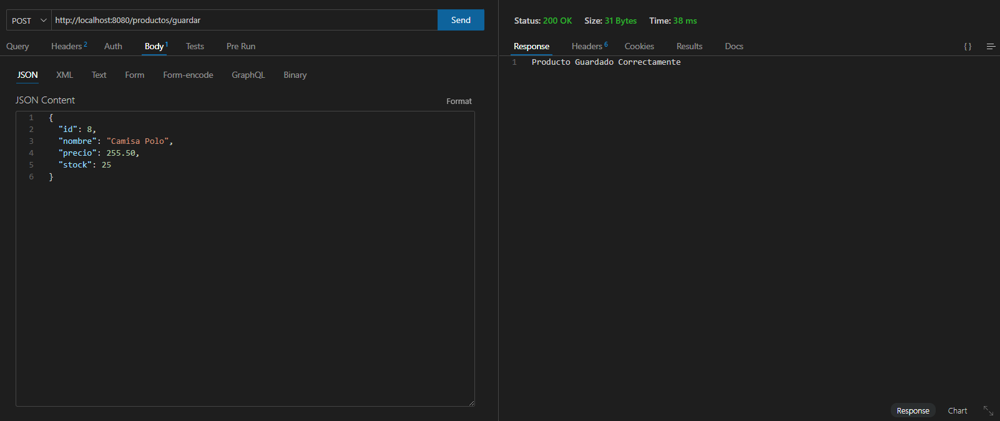
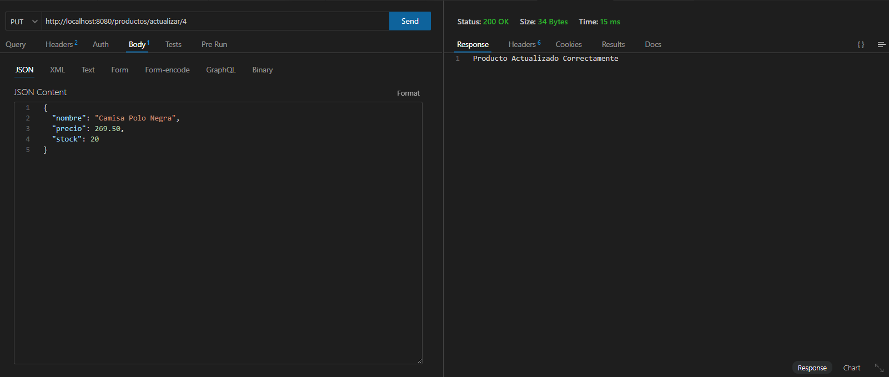

# Microservice 1 - FS Intecap

## Descripción
CRUD para clientes y productos

## Muestra de cómo funciona el CRUD:
### Listar

### Eliminar

### Guardar

### Actualizar

## Tecnologías utilizadas
- Java
- Spring Boot